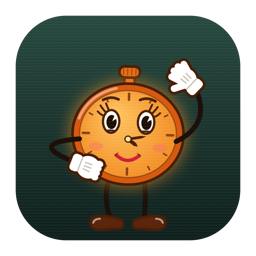
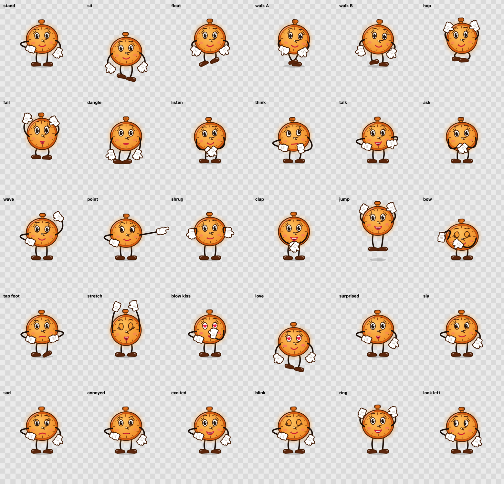

<p align="center"></p>

<h1 align="center">Claude Miss Minutes</h1>

<p align="center">An animated 1950s-cartoon clock who lives on your Mac desktop as a personal assistant, with Claude Code as her brain.</p>

<p align="center"></p>

> An unofficial fan homage to a certain time-keeping hostess. The character is original vector art drawn in code; nothing here is affiliated with Marvel or Disney.

- **Lives on your desktop**: a click-through overlay on every Space. She sits on, climbs, hangs from and hops between your windows.
- **Talks and listens**: replies are spoken sentence by sentence with lip sync, in an open-source neural voice that runs on your Mac. Hold ⌃ to talk back.
- **Thinks with Claude Code**: one long-lived `claude -p` session, with tool permission prompts in her speech bubble that you can answer with a spoken yes or no.
- **Has a body Claude can use**: MCP tools to emote, walk to an app, look at your screen and set reminders.

**[Capabilities](docs/CAPABILITIES.md)**: everything she does, the controls, tool access, voice and permissions.

**[Architecture](docs/ARCHITECTURE.md)**: the modules, the frame loop, the screen map, a conversation end to end, and how to extend her.

## Install

Requires macOS 14+ and [Claude Code](https://claude.com/claude-code), installed and signed in. Node.js is optional; without it she uses a macOS voice and Claude cannot move her.

```sh
make install          # builds, signs ad-hoc, copies to /Applications
open "/Applications/Miss Minutes.app"
```

The build is ad-hoc signed and not notarized. If Gatekeeper complains, right-click ▸ Open once, or run `xattr -dr com.apple.quarantine "/Applications/Miss Minutes.app"`.

Hold **⌃** and talk, or click her (**⌃⌥M** anywhere) and type. Double-click her and she twirls out of sight; hold **⌃** to bring her back. The menu bar clock holds the model, tool access and Settings, where Voice ▸ Download fetches her neural voice.

## Build from source

```sh
make build            # debug build
make test             # Swift tests + bridge and voice tests
make sheet            # render every pose and mood to dist/sheet.png
make dmg              # dist/MissMinutes-<version>.dmg (universal)
```

On a Mac where the Xcode license is not accepted, prefix commands with `DEVELOPER_DIR=/Library/Developer/CommandLineTools`.

## License

Apache-2.0 © 2026 Shahriar. See [LICENSE](LICENSE).
